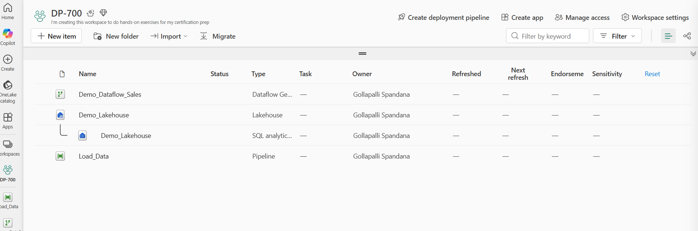
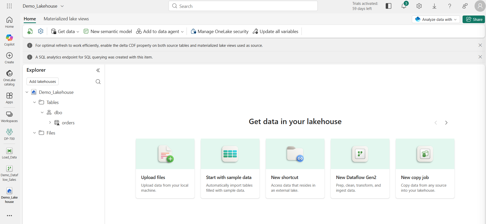
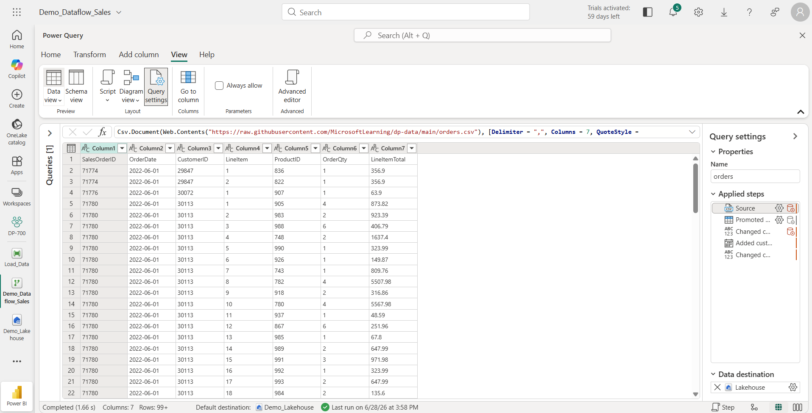
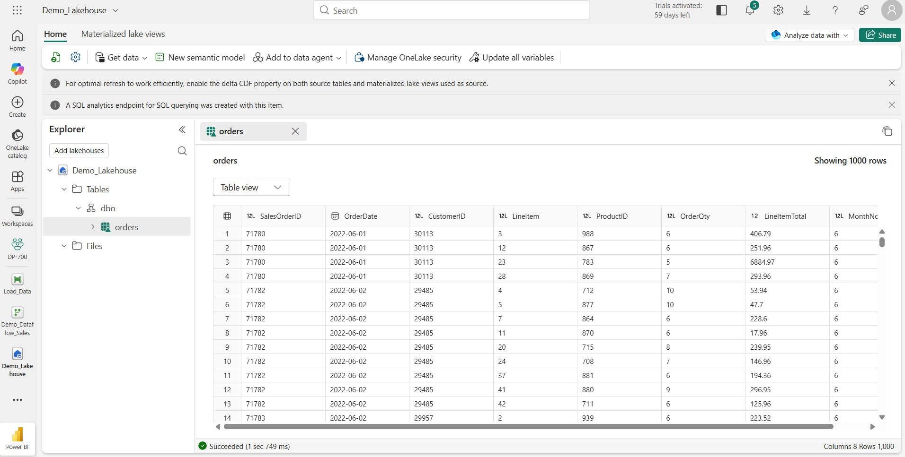
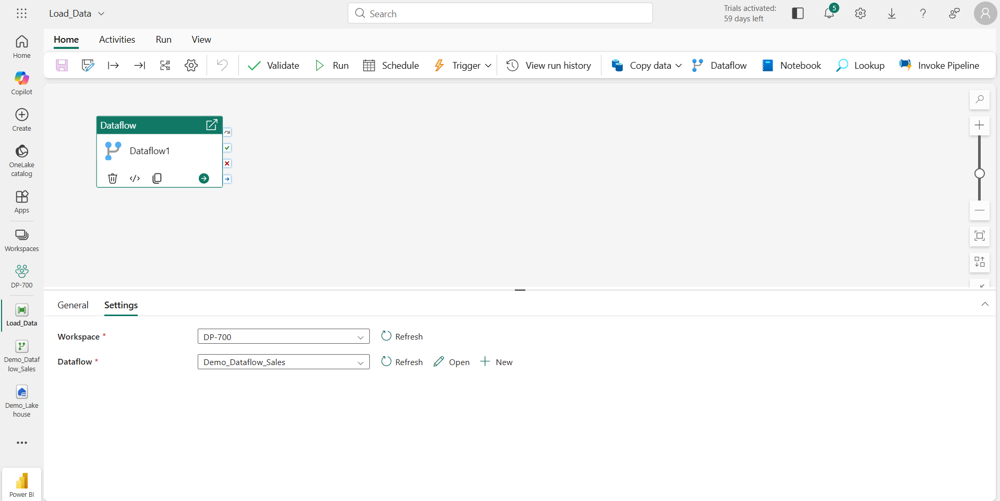
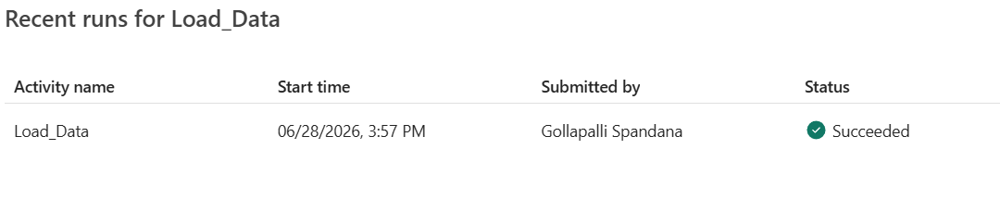

# Lab 1
# Data Ingestion using Dataflow Gen2

## Objective
The objective of this lab was to understand how Microsoft Fabric's Dataflow Gen2 can be used to ingest, transform, and load data into a Lakehouse. Additionally, the lab demonstrated how Data Pipelines can orchestrate Dataflow execution.

## Business Scenario
Imagine a retail company receives a CSV file containing customer order information every day.

The company wants to:
- Read the CSV automatically
- Perform basic data transformations
- Store the processed data in a centralized Lakehouse
- Automate the ingestion process
Microsoft Fabric provides Dataflow Gen2 for ETL operations and Data Pipelines for orchestration.

## Architecture 
```
CSV File
     │
     ▼
Dataflow Gen2
(Extract + Transform)
     │
     ▼
Lakehouse
(Orders Table)
     ▲
     │
Pipeline
(Orchestration)
```


## Steps Performed
### Step 1
Created a Fabric Workspace.

Purpose:

A workspace acts as a container for all Fabric assets such as Lakehouses, Dataflows, Pipelines, and Notebooks.



### Step 2

Created a Lakehouse.

Purpose:

The Lakehouse serves as centralized storage for structured and unstructured data.



### Step 3

Created a Dataflow Gen2.

Purpose:

Dataflow Gen2 provides a visual ETL interface using Power Query.


### Step 4

Connected the source CSV.

Purpose:

Configured the CSV file as the source dataset.



### Step 5

Performed Transformations.

Transformation performed:

- Added Month Number column

Purpose:

Demonstrates that data can be transformed before storage.


### Step 6

Configured Destination.

Destination:

Lakehouse

Table:

Orders

Purpose:

Store transformed data inside the Lakehouse.



### Step 7

Created a Pipeline.

Purpose:

Orchestrate execution of Dataflow.



### Step 8

Added Dataflow Activity.

Purpose:

Allow the Pipeline to execute the Dataflow.

### Step 9

Executed Pipeline.

Result:

Data successfully loaded into the Orders table.




## What I Learned

### Dataflow Gen2

Dataflow Gen2 is responsible for performing ETL operations.

It connects to various data sources, performs transformations using Power Query, and loads data into destinations like Lakehouses.

### Lakehouse

The Lakehouse stores processed data.

Unlike Dataflow, it is persistent storage.

### Pipeline

Pipelines do not transform data.

Their responsibility is orchestration.

They automate execution of Dataflows, Notebooks, SQL Scripts and other Fabric activities.

### Separation of Responsibilities

This lab helped me understand the architectural separation inside Microsoft Fabric.

| Component     | Responsibility |
| ------------- | -------------- |
| Dataflow Gen2 | ETL            |
| Lakehouse     | Storage        |
| Pipeline      | Orchestration  |


## Challenges Faced

Initially, I was confused about why both Dataflow and Pipeline were required. I learned that Dataflow performs the ETL process, whereas Pipelines automate and orchestrate the execution of those ETL processes.

Recruiters love seeing honest reflections because they demonstrate learning rather than just task completion.

## Key Takeaways
- Dataflow Gen2 is Microsoft's low-code ETL tool.
- Lakehouse acts as centralized storage.
- Pipelines orchestrate execution.
- ETL and orchestration are separate responsibilities.
- Power Query enables visual transformations before loading data.

## Interview Questions
### Q1 Why do we need a Pipeline if Dataflow can already execute?

Answer

A Dataflow performs ETL operations, while a Pipeline is responsible for orchestration. Pipelines allow multiple activities to be executed in sequence, scheduled, monitored, and reused.

### Q2 What is the difference between a Lakehouse and Dataflow?

Answer

A Lakehouse and a Dataflow Gen2 in Microsoft Fabric serve fundamentally different roles: one is a storage and analytics platform, while the other is an ETL (Extract, Transform, Load) tool.

### Q3 Why should transformations happen before loading into the Lakehouse?

Answer

In a traditional ETL Approach model, data is transformed in a dedicated middleware server (e.g., SSIS, Informatica) before being loaded into the destination.  This was historically used when storage was expensive and limited, so only cleaned, pre-formatted data was worth storing.

### Q4 What happens if the Pipeline fails?

Answer

When a Microsoft Fabric pipeline fails, the Monitoring Hub updates the pipeline status to Failed, and the specific Fail activity (if used) is designed to always return this failed status to provide descriptive error messages and codes.  Unlike legacy Azure Data Factory, Fabric does not have built-in, one-click alerting for failures; instead, users must explicitly manage notifications by configuring activities like Outlook or Teams to trigger on failure, or by using Data Activator to create alerts based on pipeline job events. 


