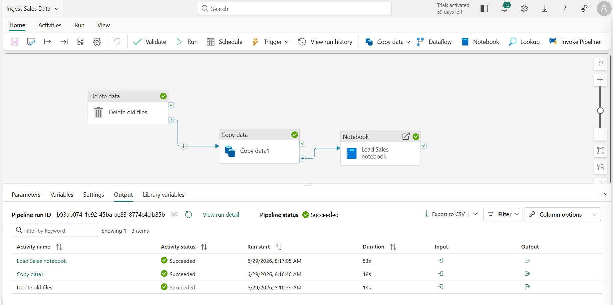
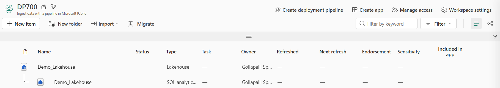
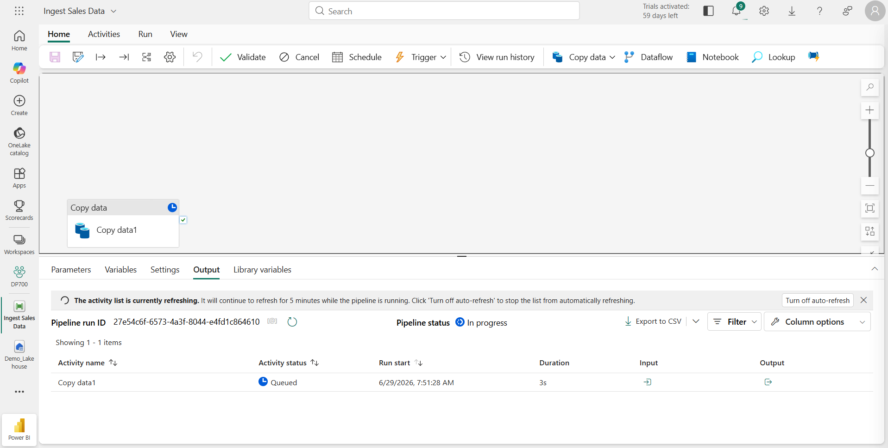
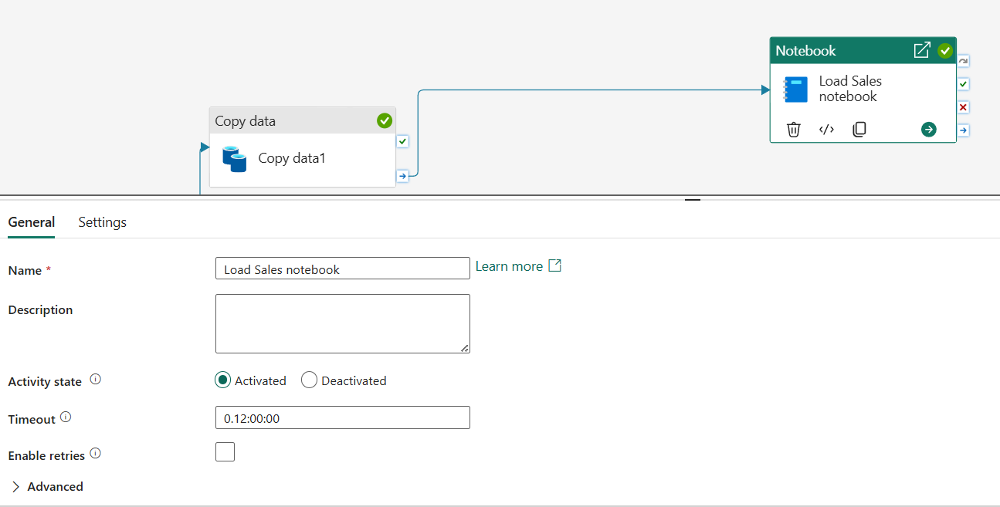
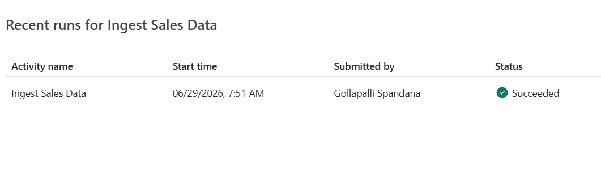
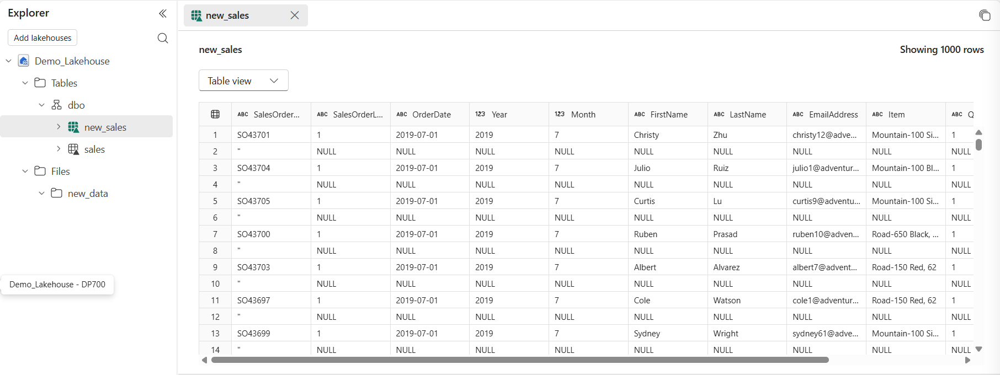

# Lab 02 – Build a Data Ingestion Pipeline in Microsoft Fabric



## Repository Note

This lab was completed as part of my preparation for the **Microsoft Certified: Fabric Data Engineer Associate (DP-700)** certification. The implementation is based on the official Microsoft Learn exercise, while the documentation, explanations, architecture, reflections, and interview notes are my own.

---

# Objective

The objective of this lab was to build an end-to-end data ingestion pipeline in Microsoft Fabric that automates data movement, executes data transformations using a Notebook, and performs cleanup activities as part of a single orchestrated workflow.

---

# Business Scenario

A retail organization receives daily sales data from an external system. To streamline data ingestion and preparation for analytics, the organization wants an automated workflow that:

- Copies raw data into a centralized Lakehouse.
- Executes data transformation logic using Spark.
- Cleans up obsolete data after successful processing.
- Minimizes manual intervention while ensuring repeatable and reliable execution.

Microsoft Fabric Pipelines provide a unified orchestration framework to achieve this.

---

# Solution Architecture

```text
                    Microsoft Fabric Pipeline

                             │
        ┌────────────────────┼────────────────────┐
        ▼                    ▼                    ▼
 Copy Data Activity    Notebook Activity    Delete Data Activity
        │                    │
        ▼                    ▼
   Raw Data Loaded     Data Transformation
        │
        ▼
      Lakehouse
```

---

# Technologies Used

- Microsoft Fabric
- Data Factory Experience
- Data Pipeline
- Copy Data Activity
- Notebook Activity
- Delete Data Activity
- Lakehouse
- OneLake
- Apache Spark

---

# Implementation Steps

## Step 1 – Create a Lakehouse

Created a Lakehouse to serve as the centralized storage layer for ingested data.

**Purpose**

Provides scalable storage in OneLake for downstream analytics.



---

## Step 2 – Configure the Copy Data Activity

Configured the source and destination for copying data into the Lakehouse.

**Purpose**

Automates ingestion of source data.



---

## Step 3 – Execute a Notebook Activity

Added a Notebook activity after data ingestion.

**Purpose**

Runs Spark-based transformations on the ingested data before it is consumed by downstream workloads.



---

## Step 4 – Configure Delete Data Activity

Added a Delete Data activity to the pipeline.

**Purpose**

Removes obsolete files after successful execution to maintain a clean storage environment.


---

## Step 5 – Complete Pipeline Design

Connected all activities into a single orchestrated workflow.

**Purpose**

Demonstrates how Microsoft Fabric Pipelines coordinate multiple activities within one automated process.


---

## Step 6 – Execute the Pipeline

Ran the pipeline and verified that all activities completed successfully.



---

## Step 7 – Validate Results

Verified that the data was successfully loaded into the Lakehouse.



---

# Key Learnings

This lab helped me understand:

- How Microsoft Fabric Pipelines orchestrate multiple activities.
- The distinction between orchestration and execution.
- How Copy Data is used for ingestion.
- Why Notebooks are used for Spark-based transformations.
- The importance of housekeeping activities like Delete Data.
- How Lakehouse acts as centralized storage for downstream analytics.

---

# Concepts Learned

## Pipeline

A Pipeline orchestrates the execution of multiple activities within a workflow.

---

## Copy Data Activity

Moves data from a source system into a destination with minimal transformation.

---

## Notebook Activity

Executes Spark code for advanced data transformations, validation, and business logic.

---

## Delete Data Activity

Removes outdated files after successful execution, helping maintain storage hygiene.

---

## Lakehouse

Stores structured and unstructured data in OneLake for analytics and reporting.

---

## OneLake

Provides a unified storage layer shared across all Microsoft Fabric experiences.

---

# Skills Demonstrated

- Microsoft Fabric
- Data Pipelines
- Data Ingestion
- Pipeline Orchestration
- Copy Data Activity
- Notebook Execution
- Spark Integration
- Lakehouse
- ETL Fundamentals

---

# Real-World Applications

This workflow can be used to:

- Daily sales data ingestion
- ERP data loading
- Customer master data refresh
- Automated data preparation for reporting
- Scheduled ETL workflows

---

# Reflection

This lab demonstrated that a Microsoft Fabric Pipeline is much more than a simple data movement tool. By combining Copy Data, Notebook, and Delete Data activities within a single workflow, I gained a practical understanding of how Fabric supports end-to-end data engineering processes.

The Notebook activity highlighted how Spark can be integrated into automated workflows for advanced transformations, while the Delete Data activity reinforced the importance of maintaining clean and efficient storage in production environments.

---

# Interview Questions

## Why would you use a Pipeline instead of manually importing data?

Pipelines automate recurring workflows, improve reliability, reduce manual effort, and support scheduling, monitoring, and orchestration.

---

## Why use a Notebook activity after a Copy Data activity?

Copy Data is optimized for moving data between systems, whereas Notebooks provide the flexibility to perform complex Spark-based transformations, data validation, aggregations, and custom business logic.

---

## What is the purpose of the Delete Data activity?

The Delete Data activity removes obsolete or temporary files after successful processing, helping reduce storage costs and maintain clean data environments.

---

## What is the difference between orchestration and execution?

A Pipeline orchestrates the workflow by coordinating activities, while individual activities (such as Copy Data or Notebook) perform the actual work.

---

# References

Official Microsoft Learn Lab

https://microsoftlearning.github.io/mslearn-fabric/Instructions/Labs/04-ingest-pipeline.html

Microsoft Learn

https://learn.microsoft.com/training/

---


