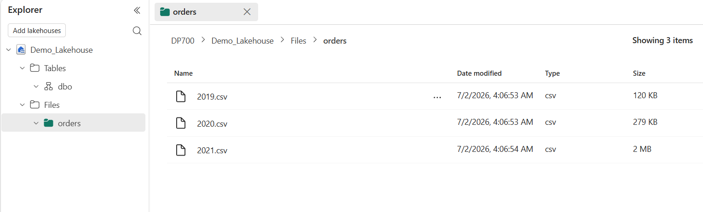
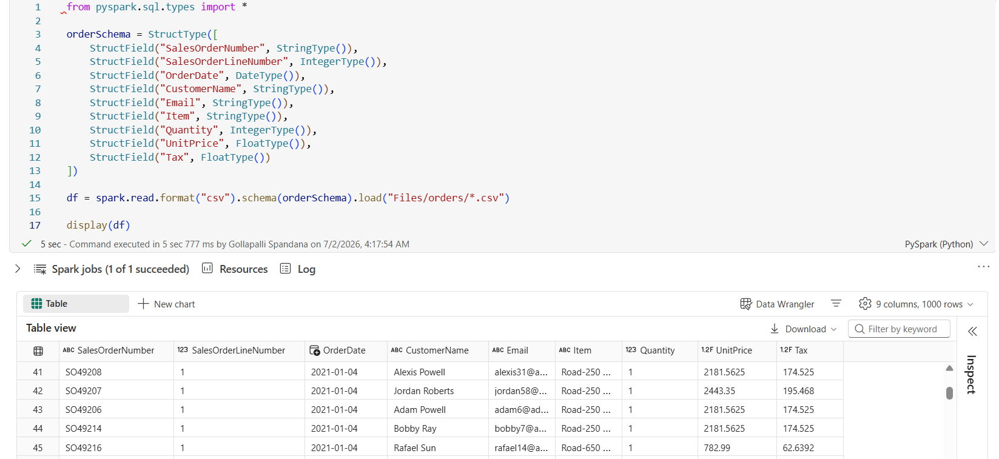
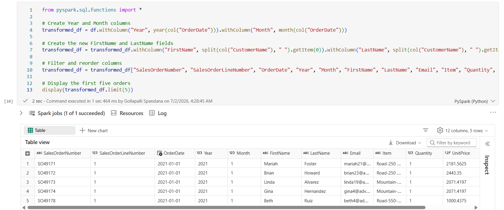
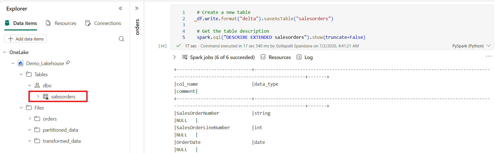
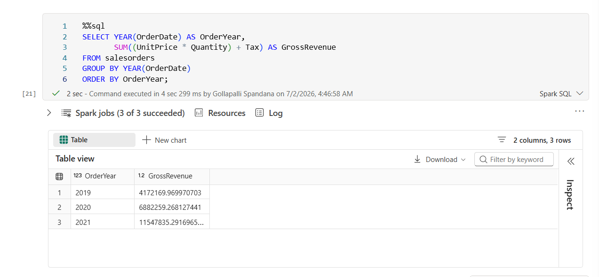
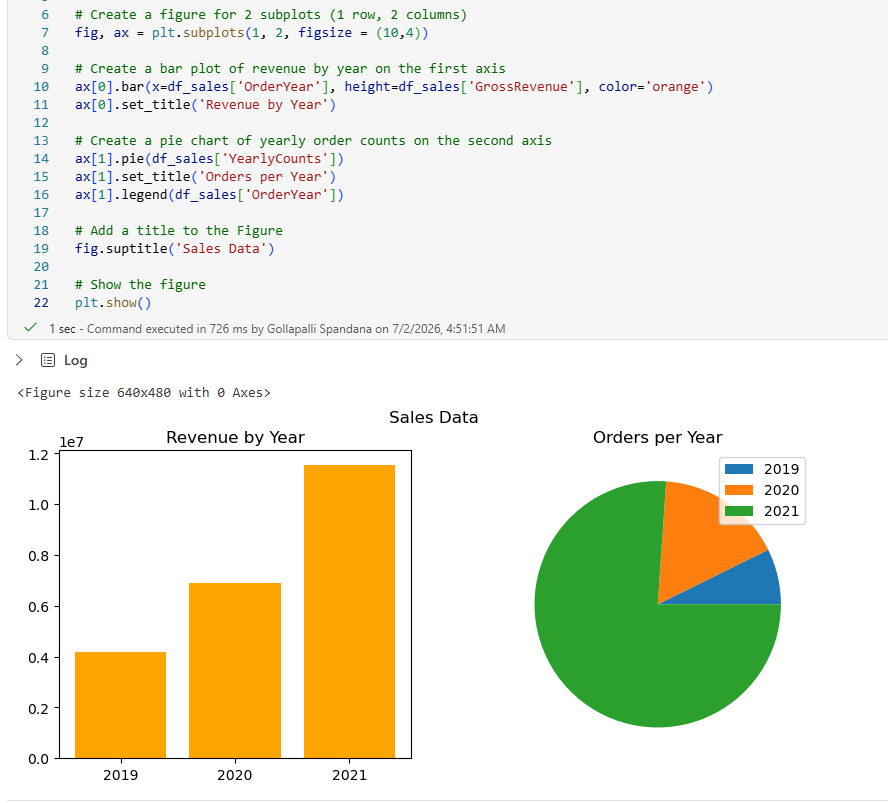

# Lab 03 – Analyze Data with Apache Spark in Microsoft Fabric

## Repository Note

This lab was completed as part of my preparation for the **Microsoft Certified: Fabric Data Engineer Associate (DP-700)** certification. The implementation follows the official Microsoft Learn exercise, while the explanations, architecture, reflections, interview notes, and documentation are my own.

---

# Objective

The objective of this lab was to analyze data stored in a Microsoft Fabric Lakehouse using **Apache Spark**. I learned how to load data into Spark DataFrames, perform transformations using PySpark, save the processed data as Delta tables, query it using Spark SQL, and visualize insights directly within a Spark Notebook.

---

# Business Scenario

A retail organization stores sales order data as CSV files in a Microsoft Fabric Lakehouse. Data engineers need to process this data efficiently for downstream reporting and analytics.

Using Apache Spark, the organization can:

- Load raw files into DataFrames.
- Clean and transform the data.
- Store processed data as Delta tables.
- Query the transformed data using SQL.
- Generate quick visual insights for business users.

---

# Solution Architecture

```text
                    Microsoft Fabric Lakehouse

                              │
                              ▼

                     Raw CSV Files (Orders)

                              │
                              ▼

                 Spark Notebook (PySpark)

                              │
          ┌───────────────────┼───────────────────┐
          ▼                                       ▼

 DataFrame Transformations                 Spark SQL Queries

          │
          ▼

      Delta Table (Lakehouse)

          │
          ▼

      Charts & Visualizations
```

---

# Technologies Used

- Microsoft Fabric
- Apache Spark
- PySpark
- Spark SQL
- Lakehouse
- Delta Lake
- OneLake
- Spark Notebook

---

# Implementation Steps

## Step 1 – Create a Lakehouse and Upload Data

Created a Lakehouse and uploaded the source sales order files.

**Purpose**

The Lakehouse acts as the centralized storage layer for raw and processed data.



---

## Step 2 – Load Data into a Spark DataFrame

Loaded the CSV files into a Spark DataFrame using PySpark.

**Purpose**

Spark DataFrames provide a distributed structure for analyzing and transforming large datasets efficiently.



---

## Step 3 – Explore and Transform the Data

Used PySpark to inspect and transform the data.

Examples included selecting columns, filtering records, creating derived values, and performing aggregations.

**Purpose**

Transform raw data into a format suitable for analytics.



---

## Step 4 – Save the Processed Data as a Delta Table

Saved the transformed DataFrame as a Delta table inside the Lakehouse.

**Purpose**

Delta tables provide reliable storage with ACID transactions, schema enforcement, and version history.



---

## Step 5 – Query the Delta Table Using Spark SQL

Executed SQL queries directly against the Delta table.

**Purpose**

Spark SQL enables analysts and engineers to query large datasets using familiar SQL syntax while leveraging Spark's distributed processing engine.



---

## Step 6 – Visualize the Results

Generated charts directly from the notebook.

**Purpose**

Provides quick visual insights into the processed data without requiring external visualization tools.



---

# Key Learnings

- Learned how Apache Spark processes data stored in a Lakehouse.
- Understood how Spark loads files into DataFrames.
- Performed data transformations using PySpark.
- Stored processed data as Delta tables.
- Queried Delta tables using Spark SQL.
- Generated notebook-based visualizations.
- Reinforced how Lakehouse, Delta Lake, and Spark work together in Microsoft Fabric.

---

# Concepts Learned

## Apache Spark

Apache Spark is a distributed data processing engine designed for large-scale analytics across multiple machines.

---

## Spark DataFrame

A Spark DataFrame is a distributed tabular data structure used for scalable data processing and analysis.

---

## PySpark

PySpark is the Python API for Apache Spark that enables developers to write Spark applications using Python.

---

## Spark SQL

Spark SQL allows SQL queries to be executed directly against Spark DataFrames and Delta tables.

---

## Delta Lake

Delta Lake extends Parquet by providing enterprise features such as ACID transactions, schema enforcement, and time travel.

---

## Lakehouse

A Lakehouse combines the flexibility of a data lake with the management capabilities of a data warehouse.

---

# Skills Demonstrated

- Microsoft Fabric
- Apache Spark
- PySpark
- Spark DataFrames
- Spark SQL
- Delta Lake
- Lakehouse
- Data Transformation
- Data Analysis

---

# Real-World Applications

This workflow is commonly used for:

- Sales analytics
- Customer analytics
- Financial reporting
- Enterprise ETL pipelines
- Business Intelligence
- Data Engineering workloads

---

# Reflection

This lab gave me practical experience working with Apache Spark in Microsoft Fabric. I learned how Spark loads raw files into DataFrames, applies distributed transformations using PySpark, stores processed data as Delta tables, and enables SQL-based analysis using Spark SQL. It also demonstrated how notebooks integrate data engineering and exploratory analysis within a single environment.

---

# Interview Questions

### Why is Apache Spark used instead of traditional SQL?

Apache Spark distributes data processing across multiple machines, making it suitable for processing large datasets that would be inefficient on a single server.

---

### What is a Spark DataFrame?

A Spark DataFrame is a distributed collection of structured data organized into rows and columns, optimized for large-scale processing.

---

### Why save data as a Delta table instead of keeping it as CSV?

Delta tables provide ACID transactions, schema enforcement, better performance, and support features such as version history and time travel.

---

### What is the difference between PySpark and Spark SQL?

PySpark uses Python code for data processing, while Spark SQL enables SQL queries against Spark DataFrames and Delta tables.

---

### What role does a Spark Notebook play in Microsoft Fabric?

A Spark Notebook provides an interactive environment for writing PySpark or Spark SQL code, exploring data, performing transformations, and visualizing results.

---

# References

Official Microsoft Learn Lab

https://microsoftlearning.github.io/mslearn-fabric/Instructions/Labs/02-analyze-spark.html

Microsoft Learn Module

https://learn.microsoft.com/en-us/training/modules/use-apache-spark-work-files-lakehouse/

---

# Key Takeaways

- Loaded data from a Microsoft Fabric Lakehouse into Spark DataFrames.
- Used PySpark to analyze and transform data.
- Saved processed data as Delta tables.
- Queried Delta tables using Spark SQL.
- Created visualizations directly from a Spark Notebook.
- Strengthened my understanding of how Apache Spark integrates with Microsoft Fabric for large-scale data engineering workloads.